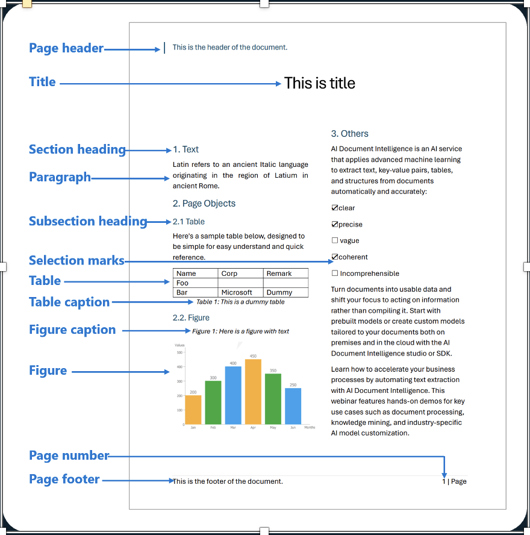
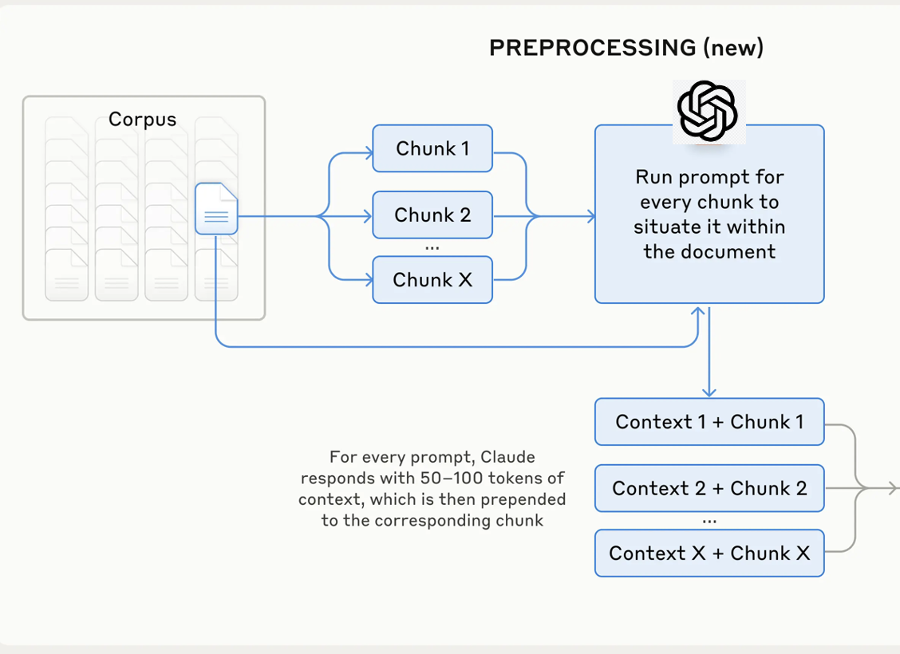

# contextual-rag

长文本的RAG准确率一直存在一些难点，随着LLM的context windows变大，有时候为模型提供的提示中包含整个知识库，而无需 RAG 或类似方法最直接高效。
但是如果如果更大的长文本的话，可能还是需要最常见的RAG方案，对内容进行切割处理。
不管用什么切割方法，有什么章节的内容，或者大表格被独立出来之后，缺少上下文等，很难被准确召回。
如果人工的一个个填充比较费事。之前通过大模型来处理，也不经济。因为每个块，都需要基于大文本来做上下文处理等。
随着prompt cache的出现，大模型本身就有混存功能，如果是PTU的话，完全免费，而且不占TPM。在paygo模式下， 也有50%折扣。

所以让使用大context对没一块内容进行，上下文填充和标题补充等变得更具有性价比。

## 1. 文件转成markdown格式

通过Azure document intellij 可以快速把PDF等文件格式转成markdown，里面包含表格，图片等。
表格已经转化成好的格式的内容，如果图片的话，如果不仅仅是图片的标签或者OCR内容的话，可以自行处理。

## 2. markdown切割和合并

因为markdown包含了原来原件的标题等信息，可以通过标题切割。因为他们天然就是语义的分隔点。
但是同上也有问题，就是有些块太大，有些块太小。太小可能导致信息不足，没有办法召回。太大的话对embedding模型，语义模型，大语言模型来说都有一些问题。
最好是保证在一个有效的范围：800~1200

所以我们首先可以把小的chunk进行一些有效的合并。大块的话，可能使用大语言模型还是小语言模型来进行二次的语义切割，尽可能的保证语义和内容的完整性。

## 3. 通过大语言模型给每个块，进行上下文补充和增加新标题

手动注释知识库中的数千个甚至数百万个块将是一项艰巨的工作。为了实现上下文检索，编写了一个提示词，指示模型提供简洁的、特定于 chunk 的上下文，该上下文使用整个文档的上下文来解释。
具体可以参考prompt目录下的内容。

## 4. 如果是使用AI search的话，就可以把相应的内容索引到Azure AI search里面

Azure AI search支持vector search + key word search的hybird search，同时也内嵌语义排序功能。
随着版本的更新，最新的版本还支持查询重写。这样不管是问题，还是切割，还是语义排序都有增强。整体的性能也表现更出色。

## 总结和效果对比

如果是使用contextual 来填充的话，召回率都有一定的提升。
下图是一个展示将上下文嵌入和上下文 BM25 相结合，将前 20 个块的检索失败率降低了 49%。

新版本的Azure AI search的query rewrite 和 新的寓意模型也有显著的提升。

